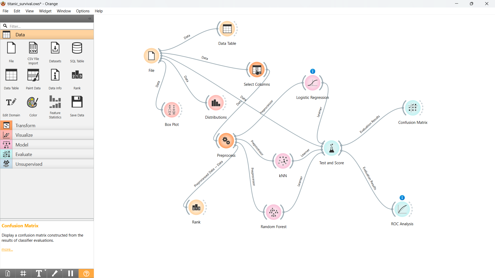
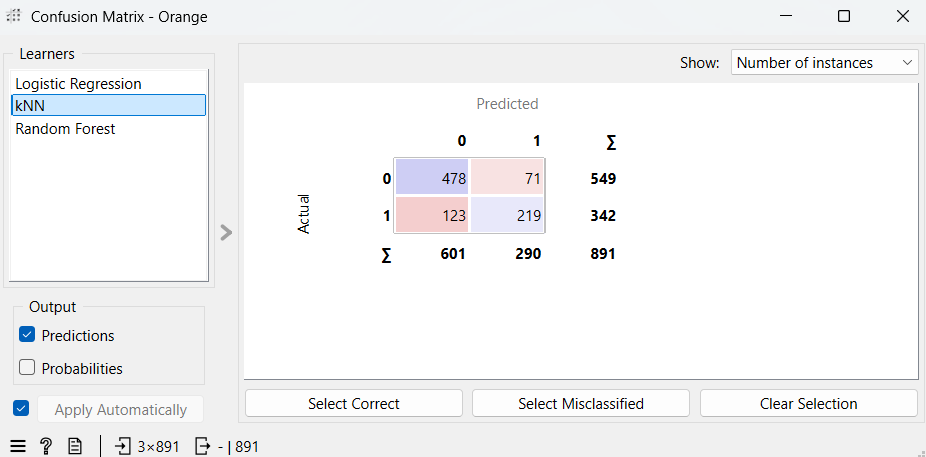
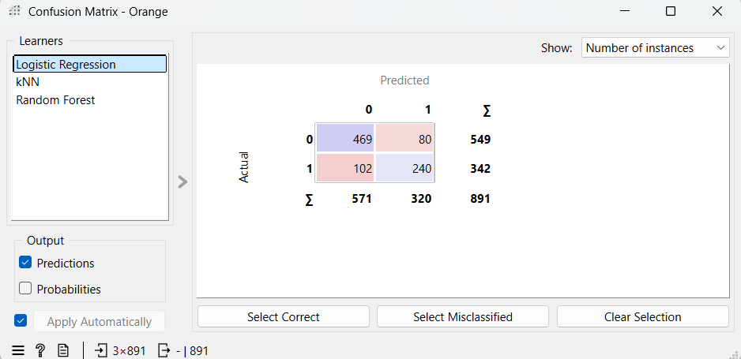
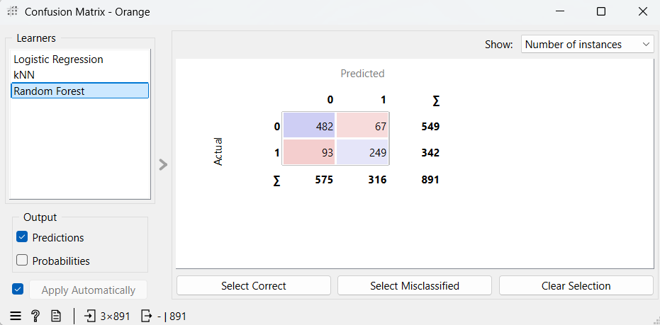
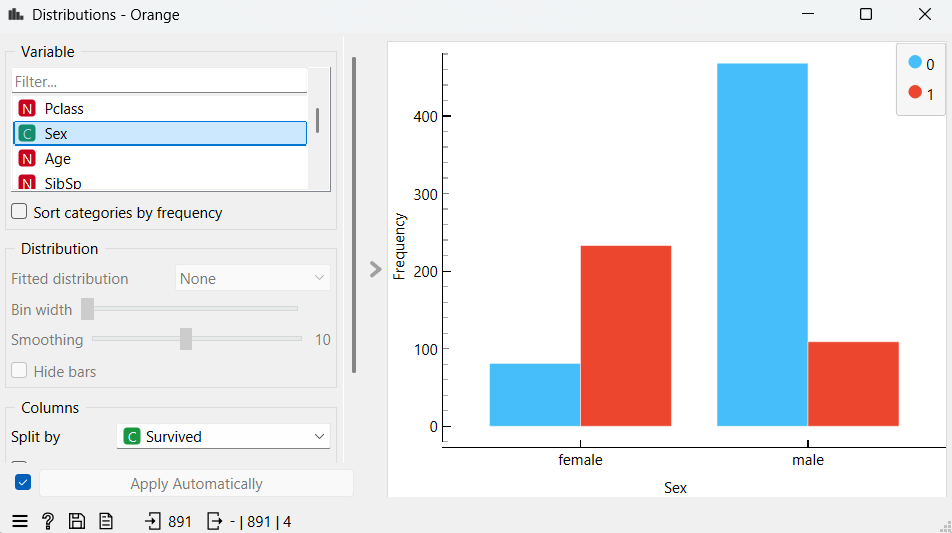
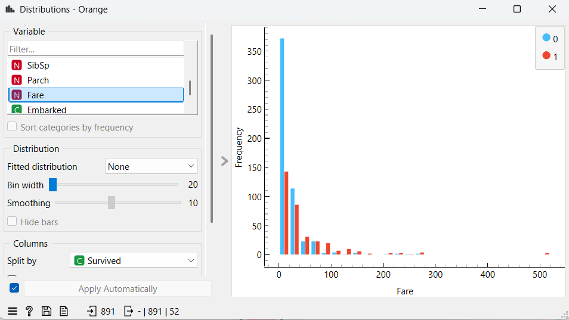
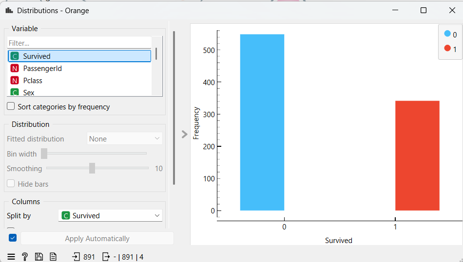
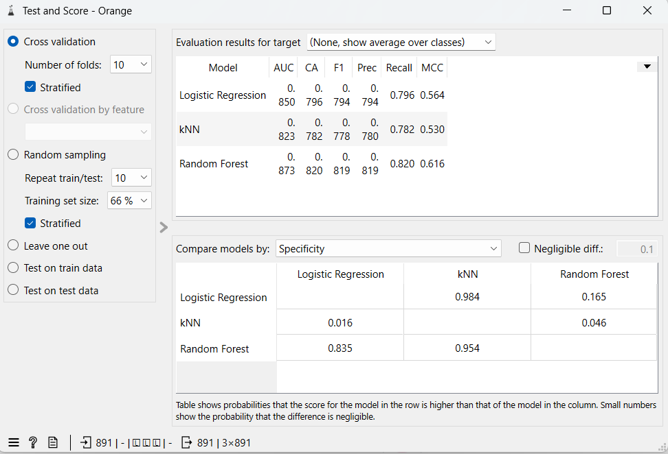
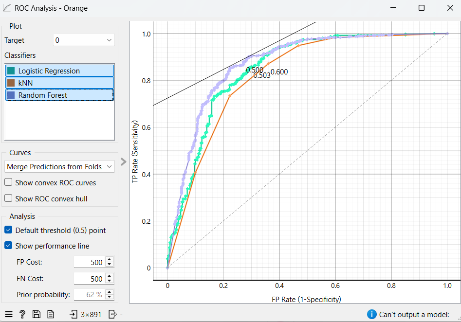

Titanic Survival Prediction (Orange3 Project)

##  Overview
This project predicts Titanic passenger survival using **Orange3**, a visual machine learning tool.  
It includes both the Orange workflow and the evaluation report.

## Files
- `titanic-workflow.ows` → Orange workflow file (open in Orange3 to reproduce the pipeline)  
- `titanic_report.html` → Test & Score report from Orange  
- `data/README.md` → Instructions to download the Titanic dataset from Kaggle  

##  Results
- Logistic Regression: Accuracy ≈ 79.6%, AUC ≈ 0.85  
- kNN: Accuracy ≈ 78.2%, AUC ≈ 0.82  
- Random Forest: Accuracy ≈ 82.0%, AUC ≈ 0.87 (**best model**)  

##  How to Run
1. Download `train.csv` from Kaggle (see `data/README.md`).  
2. Open `titanic-workflow.ows` in Orange3.  
3. Run the workflow → you’ll see results similar to the report.  

##  Screenshots

##  Report
[📄 View Report (PDF)](orange_titanic_report.pdf)

